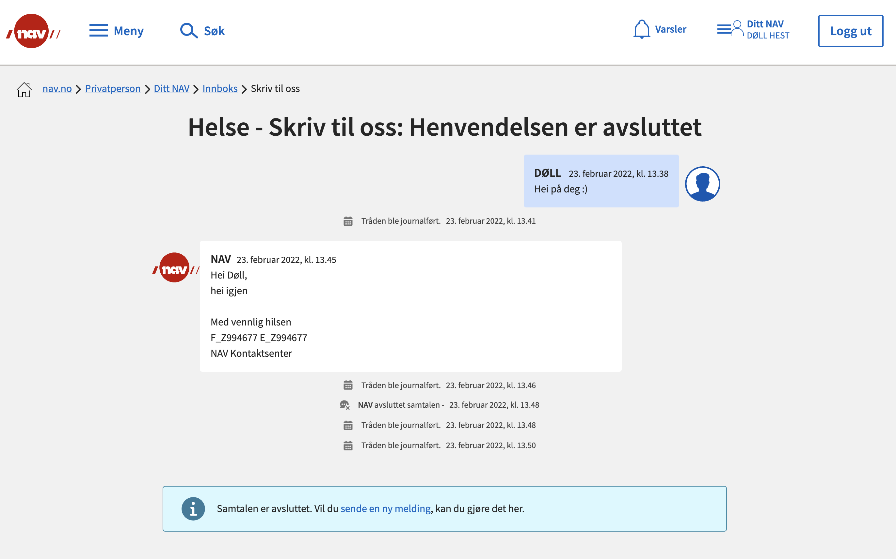
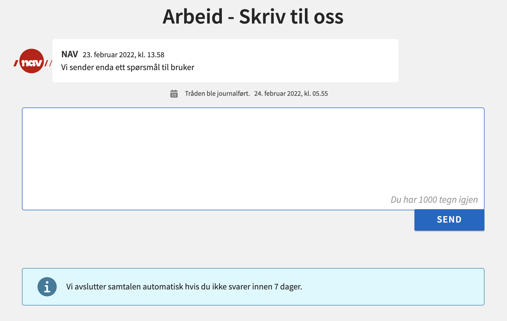

# External/Experience components

To allow for communication with an external user via a Salesforce experience, you can expose the <strong>crmMessagingCommunityThreadViewer</strong>. This component is designed to i.e. be placed on a thread detail page in community or embedded in a component that provides the viewer with the relevant thread Salesforce ID. This consists of several child components composing the message event and separates the messages from NAV (CRM_External_Message**c = false) and messages from end users (CRM_External_Message**c = true).

TO DO: The alert stripe should be considered to be moved as closing the thread is upon for dicussion as whether it should be default functionality. Also alert banner for automatic close after 7 days is specific to STO and should be restructured.

