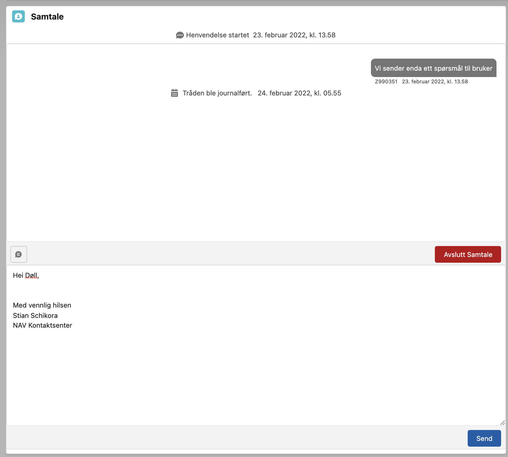
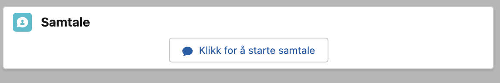
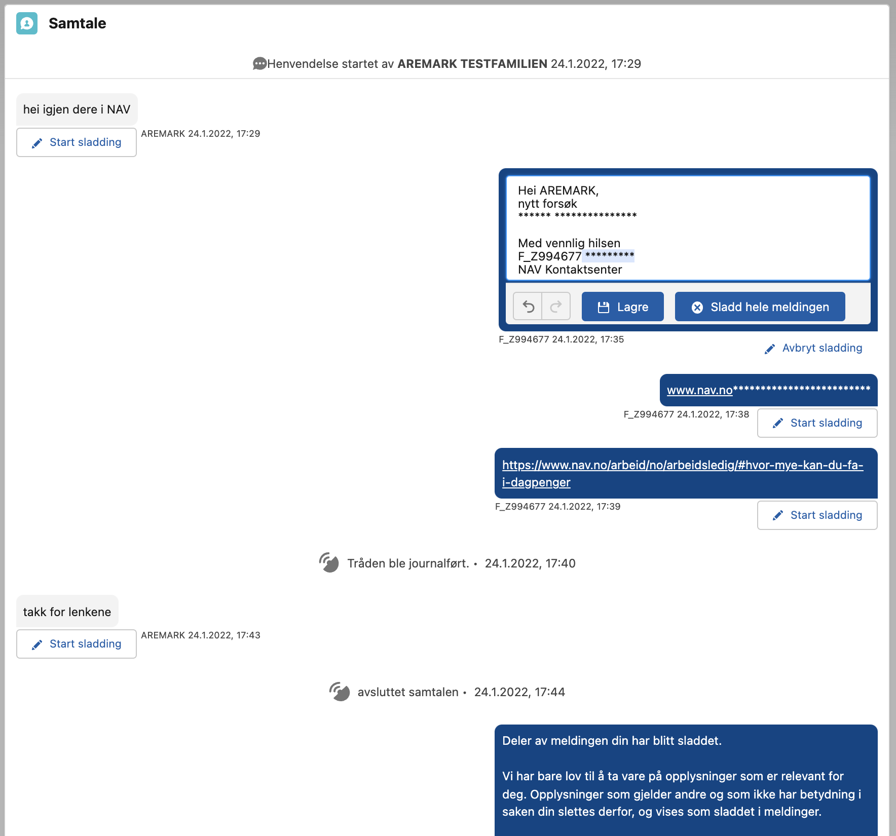

# Internal components

## Thread viewer

Internally in Salesforce a conversation can be handled using the crmMessagingMessageComponent. By placing this on a record page (other than a thread record page). The component will immediately query threads where CRM_Related_Object\_\_c = recordId. When placing on a thread record page it will load the current thread with all the messages. If there is no existing thread on the record, the "Klikk for å starte samtale" is displayed allowing to start a new thread on the record. Styling of the messags is handled by the crmMessaging- MessageInbound, MessageOutbound and MessageEvent components. Inboud/Outbound is differentiated depending on the CRM_External_Message\_\_c flag set by default in flow. Writing in the community viewer will automatically generate external messages.

TODO: Some properties in the component could potentially be exposed to allow changing some texts etc.

## Redaction

By enabling access to the <strong>crmMessagingRedactThreadViewer</strong> a thread that is marked with CRM_Sensitive_Information\_\_c (true) is in redaction mode and can be redacted. It is recommended to enable access to this component by i.e. granting a user the Redaction_Custom_Permission.

